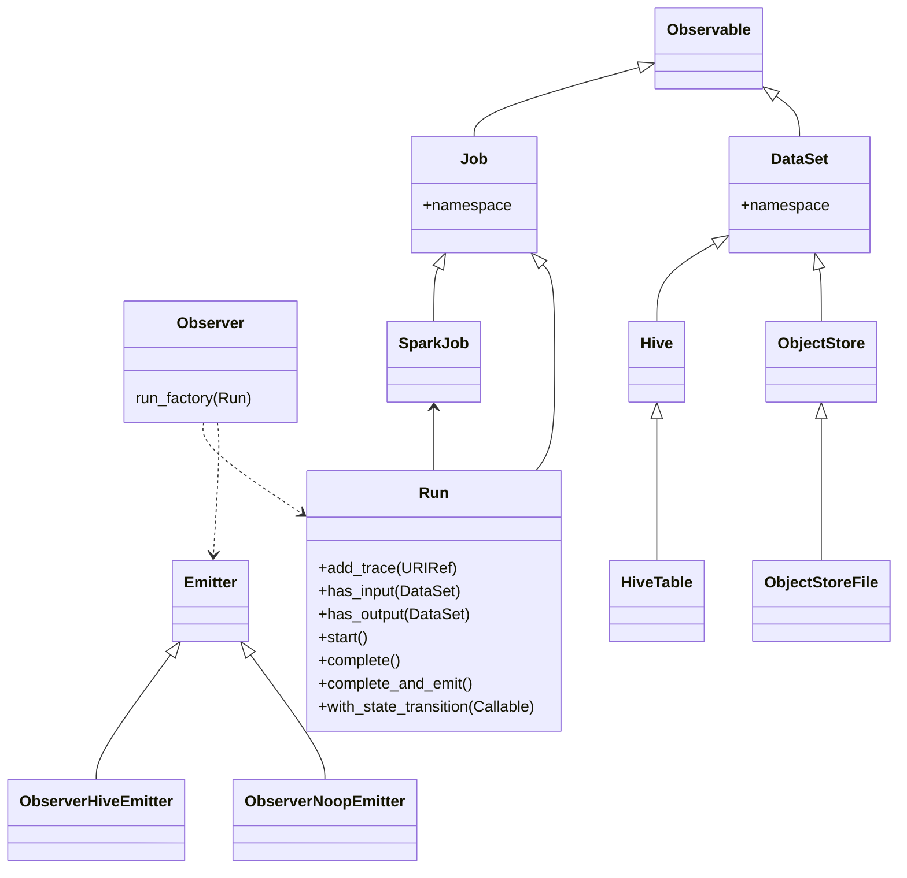

# Observer

A collection of patterns that allows a Python "job" to describe itself, its inputs, its output, and job metrics. A is an
abstraction for any Python code that is considered a unit of processing that is interesting to observe, say, from a
lineage perspective.

There are 3 main abstractions:

+ Job.  [Open Lineage](https://github.com/OpenLineage/OpenLineage) use of the "Job" concept appears biased to a data
  centric architecture. Airflow ETL DAGs are collections of Jobs. Spark jobs are, well, Jobs. A Flink streaming pipeline
  is a Job. A job being a data-centric abstraction of a task _scheduler_ of some sort. The `Scheduler` abstraction
  provides a layer above the job, allowing for other job types to be defined (such as applications (services,
  micro-services) that generate data as a product). Temporally, a job is a version of software whereby the logic remains
  consistent. Jobs have identities that are URI (typically URLs) that have the characteristic of peralinks, that is, the
  job can know, a priori, what its identity is without the need for some centralised registry (like a catalogue).
+ Run. A run is, well, an instance of a job run by some scheduler. It's the job "run" at a certain time.
+ DataSet. An abstraction for data in some form that is either consumed as input or provided as output by a job.

Let's talk lineage!  For an operator `T` producing output `O`, lineage consists of triplets of form `{I, T, O}`,
where `I` is the set of inputs to `T` used to derive `O`. Using our job/run/dataset terms, the _run_ of a _job_ consumed
a set of inputs as _datasets_ and provides outputs as _datasets_. Therefor lineage. Well. Not really!

## Configuring Observability



We start by determining the types of things. What type of _job_ are we observing, and what _dataset_ types the job
consumes and produces.

The Observer provides the following subclasses of jobs and datasets.

+ Job.
    + `SparkJob`. A job which runs on a Spark cluster.
+ DataSet
    + `HiveTable`. A table stored within the Hive Metastore.
    + `ObjectStoreLocation`. A blob storage location, such as an S3 bucket or a Azure Data Lake Storage folder.

The first task is to define subclasses for each type of job and dataset you instances of each of the job and dataset.
We'll being using these for our run's `{I, T, O}`

Let's say our job consumes from a Hive table, and writes to another Hive table. A good thing for a job to do. We're
dealing with the observables `HiveTable` and `SparkJob`. The first thing to do is set up the URIs which will define the
namespace for the table and job. These URIs are the "identities" of the table/job, and act as a root for any instance
URI created by the observer. For example, the HiveTable's identity will be defined
as `<hive-uri-namespace>/<table-fully-qualified-name>`. Which gives us something
like `https://example.nz/service/datasets/dataset/db.table`.

Namespaces are established on the classes `SparkJob`, `Hive`,  `ObjectStore`. We use the `observer.define_namespace`
helper to configure the namespaces.

So, let's set those up in some initialiser.

```python
from observer import observer

observer.define_namespace(observer.SparkJob, "https://example.nz/jobs/job")
observer.define_namespace(observer.Hive, 'https://example.nz/service/datasets/dataset/')
```

Now we can go ahead and define the instances of the DataSet and Job types we'll be observing. These classes have
are simply types with an appropriate inherited parent.

```python
class RunOfMySparkJob(observer.Run):
    pass


class MyInputHiveTable(observer.HiveTable):
    pass


class MyOutputHiveTable(observer.HiveTable):
    pass
```

## Running a Run

We're going to use the observer factory to create a SparkJob run. When we use this factory we provide
an [emitter](#emitters) what will output the observability data to some location. We support 2 emitters.
The `ObserverNoopEmitter`, well, does nothing. The `ObserverHiveEmitter` persists the observability data to a Hive
table.

Firstly, we'll get an instance of an `Observer`. We give it an environment string, an instance of the Job type, and our
emitter.

```python
obs = observer.observer_factory(env="test", job=observer.SparkJob(), emitter=observer.ObserverNoopEmitter())
```

If our job has multiple logical runs, we can initialise the observer once, and use the observer to generate individual
runs. For example, consider a job that processes multiple files or streams based in a single run of the job. Let's say
we want to split the observability events into 1 event per file/stream handled. We initialise the observer once, when
use it to create separate logical run instances as we process each file.

To create our run we use the observer.

```python
run = obs.run_factory(RunOfMySparkJob)

# We can reuse the observer to create another run by invoking...
run2 = obs.run_factory(RunOfMySparkJob)
```

Now we have a run which we can use to capture observability events.  We'll look at that next.

## Observable Events

The following events can be provided to an instance of a run.  Each event is a method on the run.

+ `start`.  No args.  Sets the time (in UTC) indicating the start of the run.
+ `complete`.  No args.  Sets the time (in UTC) of the end of the run.
+ `has_input`.  An instance of a `DataSet` type.  Indicates that the run consumes a dataset.
+ `has_output`. An instance of a `DataSet` type.  Indicates that the run produces a dataset.
+ `has_trace`. A string or URI (use the `observer.uri_ref` builder).  An opaque identifier used for tracing either the run itself or, in a distributed tracing pipeline, the pipeline identity provided by the pipeline.
+ `with_state_transition`.  A Callable that takes the current state of the run and emits a `Tuple[str, str]` containing the new_state and the state transition event.  The run maintains a simple state transition history of states and transitions.  The callable is a higher order function which transitions the run state.  The state transition is saved as history and (possibly) emitted by the Emitter.

Let's see these in action:

```python
# Start the run.
run.start()

# Provide a trace
run.add_trace('https://example.com/service/jobs/job/trace_uuid')

# Process an input dataset
run.has_input(dataset=observer.ObjectStoreFile(location="/folder/object1"))

# Produce an output
run.has_output(dataset=MyOutputHiveTable(table_name="myOutputTable1", fully_qualified_name="myDB.myOutputTable1"))

# Transition the state to complete via the completed event 
run.with_state_transition(lambda _s: ("STATE_COMPLETE", "EVENT_COMPLETED"))

# Finally complete the run
run.complete()
```

Notice we haven't emitted anything yet.  There are 2 options here, the first is to complete and emit using the run instance.  This will emit only the individual run, not any other runs which might be known to the observer.  The second is to using the observer instance.  This will emit all the runs known to the observer as rows (if we're using the Hive emitter). Emitting is idempotent; we can't emit the same run twice.  Admittedly we're using a Noop emitter, but let's emit the run data anyway.

```python
# Complete and emit at the same time (which emits only the run)
run.complete_and_emit()

# Emit using the observer (which emits all the runs known)
obs.emit()
```


## Emitters


